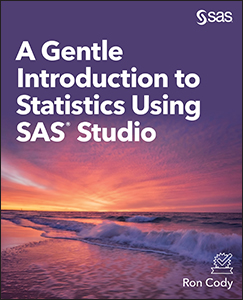

# A Gentle Introduction to Statistics Using SASⓇ Studio 
Ron Cody
 
 

This repository contains the sample code for the book *A Gentle Introduction to Statistics Using SASⓇ Studio*. 

Data files are .xlsx files. Sample programs are .sas files.

## Description
Point and click your way to performing statistics!

Many people are intimidated by learning statistics, but *A Gentle Introduction to Statistics Using SASⓇ Studio* is here to help. Whether you need to perform statistical analysis for a project or, perhaps, for a course in education, psychology, sociology, economics, or any other field that requires basic statistical skills, this book teaches the fundamentals of statistics, from designing your experiment through calculating logistic regressions. Serving as an introduction to many common statistical tests and principles, it explains concepts in a non-technical way with little math and very few formulas. Once the basic statistical concepts are covered, the book then demonstrates how to use them with SAS Studio and SAS University Edition’s easy point-and-click interface. 

Topics included in this book are:

- How to install and use SAS University Edition 
- Descriptive statistics 
- One-sample tests 
- T tests (for independent or paired samples) 
- One-way analysis of variance (ANOVA) 
- N-way ANOVA 
- Correlation analysis 
- Simple and multiple linear regression 
- *Binary logistic regression 
- Categorical data, including two-way tables and chi-square 
- Power and sample size calculations 

Questions are provided to test your knowledge and practice your skills.

## Details

*Epub* ISBN: 978-1-64295-534-7 
*Kindle* ISBN: 978-1-64295-535-4 
*PDF* ISBN: 978-1-64295-533-0 
*Paperback* ISBN: 978-1-64295-532-3 
*Hardback* ISBN: 978-1-64295-541-5

<a href="https://www.sas.com/storefront/aux/en/spstatintro/73143_excerpt.pdf">Book Excerpt and Table of Contents</a>

<a hred="https://support.sas.com/en/books/authors/ron-cody.html">About the Author</a>

  

## License

This project is licensed under the [Apache 2.0 License](./LICENSE).

